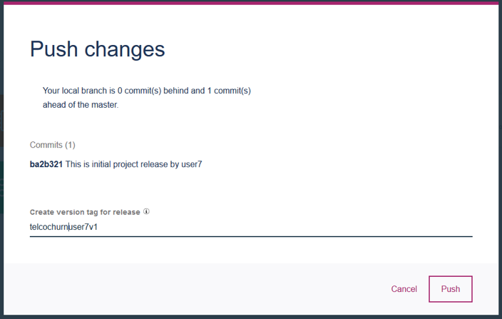
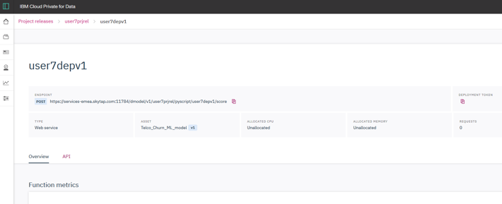
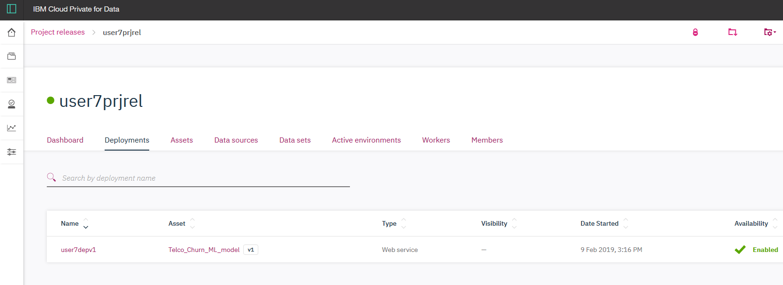

## Model Deployment in MMD of Cloud Pak for Data

Prepare the model artifacts for deployment in production setup so that we can score new records. The data scientists may tag a model once satisfied with the result as “published” for production consumption. In ICP for Data platform this step is called creating “Project release”.  

Navigate to the project homepage by clicking the Project Name. Click on “Git actions” and click “Commit” from top right menu (similar to that shown in the diagram below). This will (commit) all of the assets to the project repository.

The “commit” screen will show list of the assets that are created in this project (similar to that shown in the diagram below). Enter suitable comment for e.g. “This is initial project release by user7”.

Click ‘Commit ‘. You will get a message window confirming the changes were commited and now available to “push” for deployment.

Click on “push” by clicking on “Git actions” and select “push” (similar to that shown in the diagram below). We need to create a “tag” for our release, so that a version of this model can be identified for deployment. For e.g. enter tag as  “telcochurn<your user id>”. 

Now a Deployer can start working on Deploying the model. For that he/she has to first create a release for this project. A project release represents a project tag that can be launched as a production environment. The deployer  can monitor releases and deployments from the Project releases page. To allow him/her do the same, first you have to make the Deployer a collaborator in your project. You can add an existing user of this platform as collaborator to this project by going the Collaborator tab of the project and adding a Collaborator (similar to that shown in the diagram below). Once you click the Add Collaborator you shall see the name of all other users. Add the Data Engineer UserId. Give that person Admin privilege for the project in the Permission column. Click the ‘Add’ button.

The deployer has to login and go to the Project List by clicking the Projects in the left navigation menu. The project you created as other user would appear there. By clicking the project name, the deployer would go to the home page of the project. Next he has to Click the ‘Pull’ from the Repository icon drop down on the right top of the project home page. He/She may get the message saying you are up to date.

However, for this Lab you can use your user id to play the role of the Deployer and execute the subsequent steps.

Navigate to the home menu and select ‘Model Deployments’ under ‘Administer’ from the left navigation menu. It will take you to the Project Release page. To add a new project release Click “Add Project Release “ from right hand side option.

Add in the details of your Project Release under the ‘From Watson Studio’ tab.

These details should be unique. For e.g.
Name : user7telcochurnprjrel
Route : user7telcochurnprjroute
Source Project : TelcoChurnUser7Prj (This is the project you are working so far on)
Tag : telcochurnuser7v1 (this is the tage you gave entered while pushing the project) 

The name can contain hyphens but not special characters such as a period (.).  The route is the unique ID for the project release, and is used within the deployments' REST paths and URLs. This is a unique part of the url that will be assigned to all of the assets that are created related with this project. Name of the “route” must be lowercase. Please remember the route you provided in this step.

Click ‘Create’ . This creates an offline release.

Now, Click on “Project releases” from top left. This will show currently available releases. Note that your view shows 0 under Deployments. We will be deploying a model asset within this project release.

To view details of the deployed project, from Project release page, click on deployment name that was just created for e.g.  “user7prjrel”. This will bring up Dashboard for the deployment with several detailed tabs for more information about the Project release.

Click on Asset tab to see all deployed assets related to this Project release if the system does not take you there automatically.

Next we will create a “Realtime online deployment” of the model. The Cloud Pak for Data platform will package the required model artifacts and package it as a docker container along with any runtime execution environment. This container is isolated image from other “development” services that are running. An administrator can provision multiple replicas of this service in order to full-fill concurrent access to model scoring in production. 

In the Assets tab, you can see all of the analytics assets. There are notebooks, models, and scripts that we created previously. 
Selct the model with the name that you created in model creation step, (say something like ‘Telco Churn Model<your user id>’)  on the left and Click “web service”. This will bring up “Deploy” window expecting input as shown below.

Fill in the deployment details. For example :
Name : user7telcochurndepv1 (it should contain only lower case letter and number)
Model version : 1 
Web service environment : Python 3.6 – Script as Service. 

Please note that programing language and its version of the environment you select here should be similar to the one you have used for creating the model. For example, if you have used Python 3.6 Spark 2.3.2 as environment while developing the model here the environment you select should be Python 3.6 – Script as Service

Click “Create”. This will bring deployment Overview screen with API tab as shown below.

Note your Web service ENDPOINT URL and access token. At this time, the online deployment is created. You could also find the REST API and deployment token under ‘API’ tab. Simply click, the token is copied to your clipboard. 

However, note that the deployment is not active as yet. We will need to “Launch” the deployment in order instantiate required execution environments. 

Click on Project releases tab from top left side tab. Click on 3 dots right of project release name. You will see screen options as similar to below.

Click “Launch” . This will prompt showing all deployments will be taken online for end user access. Click “Launch” again in the current screen. This will show confirmation message that deployment is successfully brought online. Actual instantiantion of environments and setup could take 1-2 minutes before APIs can be accessible. Under project releases , “Deployments” will show count as 1.

Click on Project release name. This will bring back Dashboard. Click on Deploments tab, now this will show 1 model with “Avaliablity” as “Enabled” . (The enabled status may not change for 1-2 minutes after “Launch” step. Allow some time, it it is still in “disable” state. May need to click to different tab to update status.).

Click on deployment name ( for e.g. user7depv1 ). This will bring up “Overview” and API tab for this deployment. To test the endpoint is functioning, we can run a sample record to score. Click on API tab and Click “Submit” under “Body” window. 

This will show scoring of 1 record using real-time deployment of the model. The Response is shown as JSON record. You are here mimicing the invokation of the Rest API for scoring the model as you would do to for online real time Scoring.

Note: Generate Code option on top right shows how to invoke REST API call using cURL command.

Your Customer Churn model asset was developed, trained, and deployed for production scoring usage. You have also invoked the model’s scoring API real time as you would call it for online real time Scoring.
