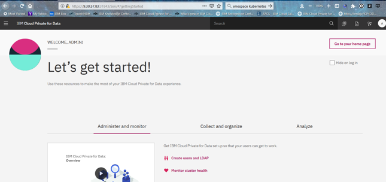
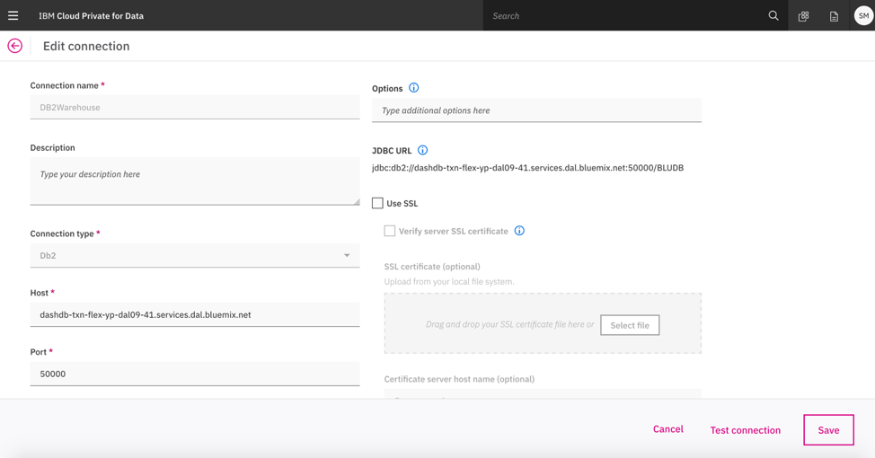
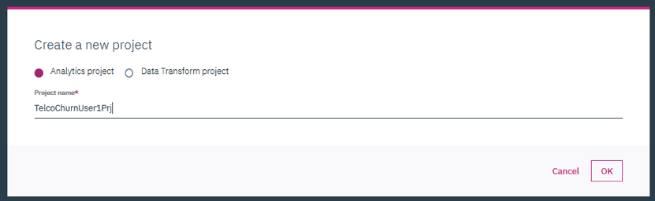

# Initial Setup for Cloud Pak for Data

Cloud Pak for Data should be either installed for developing this use case or you have to install the same using the instructions available <here>.

Once Cloud Pak for Data is installed, various users need to be created. These users should have been already created with necessary access rights.

You should have following information available with you for developing this use case -

a. Cloud Pak for Data - URL
b. Watson Open Scale add on for Cloud Oak for Data - URL
c. JDBC URL, Login id and Password for DB2 Wearhouse internal to Cloud Oak for Data
d. Credential of a User Profile (user id/password) that has access right of Administrator, Data Engineer, Business Analyst, Data Scientist, Data Steward and App Developer

Use the above information to login to Cloud Oak for Data UI and Watson Open Scale UI to ensure that you can get started.

On successful login you will see a welcome page as below

Next, you should create a Global Connection for DB2 Wearhouse internal to Cloud Oak for Data using following steps -

Click on Connections in the left Navigation menu.
<cp4dLeftNav.png>

Connections allow you to create data connections and browse the data connections that you can use to add data to the enterprise governance catalog, analyze data, virtualize data, and more. 
 
Click ‘Add Connection’. The ‘Add Connection’ will open a screen as below.

Provide all the details. Then you can test the connection using “Test Connection” button at the right bottom of the screen. If the “Test Connection” step is successful ‘Save’ the same. 

One can also upload custom driver if the data source is not available in the drop-down list of out-of-the box sources.

Next, create a Project to get started. 

A project is a collection of assets that you use to achieve a particular data analysis goal. Your project assets can include:

* Notebooks
* RStudio files
* Models
* Data assets (local files, data sources, and remote data sets)
* Scripts

Login with your UserId. Go to Projects from the left Navigation Menu. Then click on Add Project. This would show you the Create Project screen below.

If you have not downloaded already, please download the Sample Project file from the Cloud Oak for Data folder under Sample Projects in the root of this repository. After download rename downloaded file to TelcoChurnPrj<your UserId>.zip. To import project select ‘From file’. drag and drop or browse for the Zip file you downloaded earlier (TelcoChurnPrj<Your UserID>.zip).

Click ‘Create’, then the project is created. It will take you to the “Assets” page of this project. 

Alternatively, you can also create a blank project by using the first left tab and providing the same name as above. Later on you need to add datasets and Notebooks to this project.
