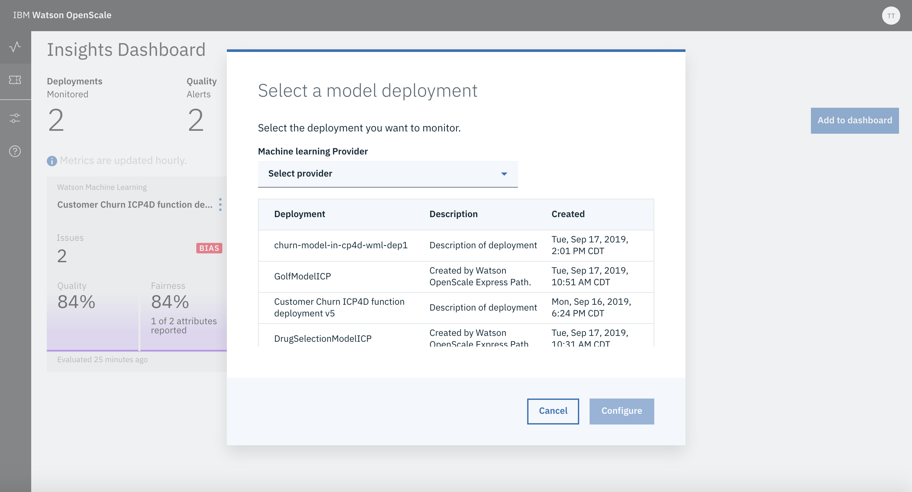
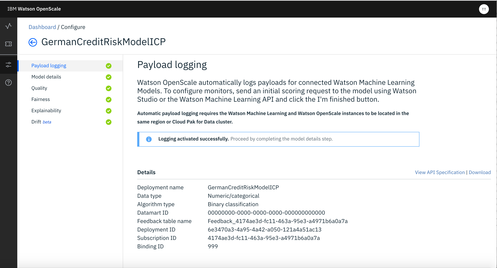
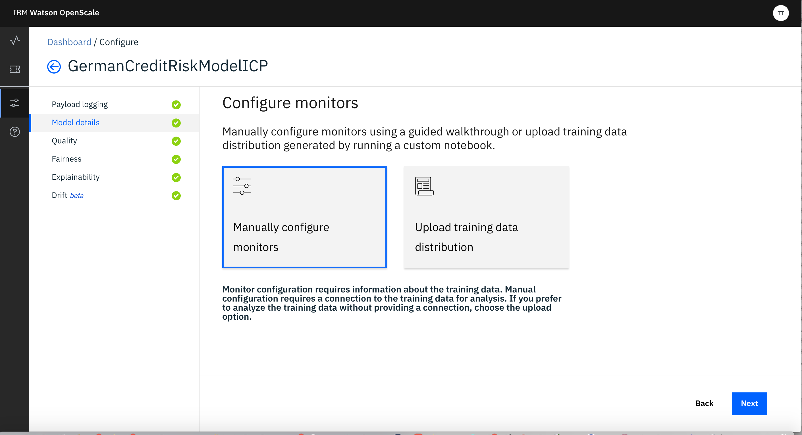

# Adding Deployment and Configuring the Model

If the initial configuration of Watson Open Scale is done, there would be Add Deployment button that can be used to add a specific deployment for monitoring purpose.

This will bring up a screen showing list of available Deployments. This list must show the 2 Deployments you have created in previous steps.

For Customer Churn use case add the Python Function Deployment (which internally access model deployed in MMD) by selecting the corresponding Deployment name shown in the available Deployment list.

Next, for that Deployment you need to send few scoring requests. 

Navigate to the ‘Notebooks’ tab of your project and open ‘Payload Scoring For Watson Open Scale’ notebook using Jupyter with latest/highest version of Spark environment. You can select the environment by clicking the 3 vertical dots at the right of the name of the Notebook. 

Follow the notebook instructions and execute all cells as directed.

Please note following -

1. While accessing the deployment use appropriate Deployment Id that corresponds to the Python Function Deployment .

3. Wherever, user credentials are needed please use your user if and password

4. Wherever, urls are needed use the Cloud Pak for Data URL (ip/host name and port) provided to you.

After this step Watson Open Scale would allow you to configure the Model with the message that Logging Activated Successfully.

For Configuring Model you need to first click on Model Deatils and select Manually Configure Monitors.

1. Provide Location of Training Data - 

In case of Cloud Pak For Data you have to specify any DB2 database for the same. For this lab specify the credential of internal DB2Wh of the Cloud Pak For Data (you should have it already as discussed in Getting Started step for IBM Cloud Pak for Data). 

After you provide the location of Training Data, you need to select the schema and Table where the Training Data is stored. It should be same as the one you used in Model Development step.

2. Identify Type of Inputs (the type of data used by model) - specify Numerical/Categorical

3. Identify Algorithm Type - specify Binary Classification

4. Identify the Label and Features of the Model from the attributes displayed to you. Also need to specify the attributes those are Categorical. Also you need Identify the attributes that you need to monitor as Prediction from the Model and the the attribute that identifies the Probability.

Next you need to configure the Monitors -

1. Configuring Monitor for Fairness -

a) Identify Age and Gender are the attributes those you want to Monitor for Fairness. These two are sometimes automatically identified by Open Scale as attributes to be monitored for Fairness based on the training data.

b) Use, 'F' (as False) as favorable outcome and 'T' (as True) as unfavorable outcome.

c) For monitoring Gender, use 'F' (as Female) as Reference group and 'M' (as Male) as Monitored group. Use 97% as threshold for Bias. And use 50 as the minimum sample of records to be used.

d) For monitoring Age, use 40 to 60 as Reference group and 22 to 35 (as Male) as Monitored group. Use 97% as threshold for Bias. And use 40 as the sample of records to be used.

2. Configuring Monitor for Accuracy -

a) Use 95% as accuracy Threshold

b) Use 50 as minimum sample and 200 as maximum sample

c) Upload the 'customer_churn_wos_quality_feedback.csv' provided as feedback file.
