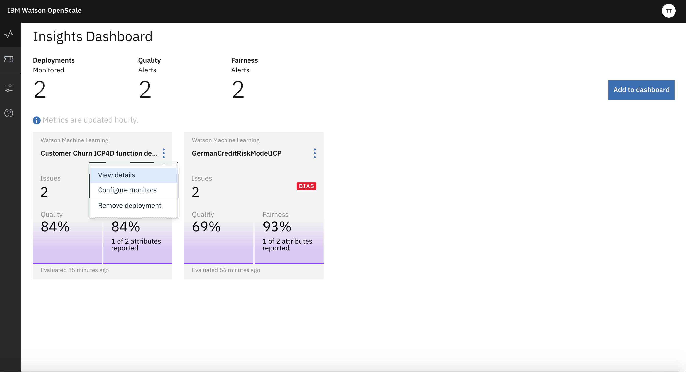
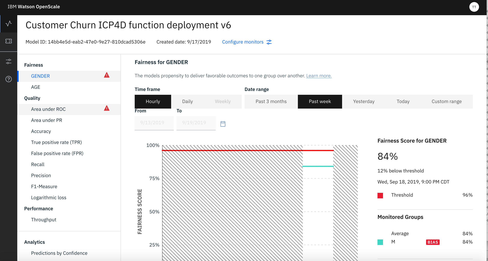
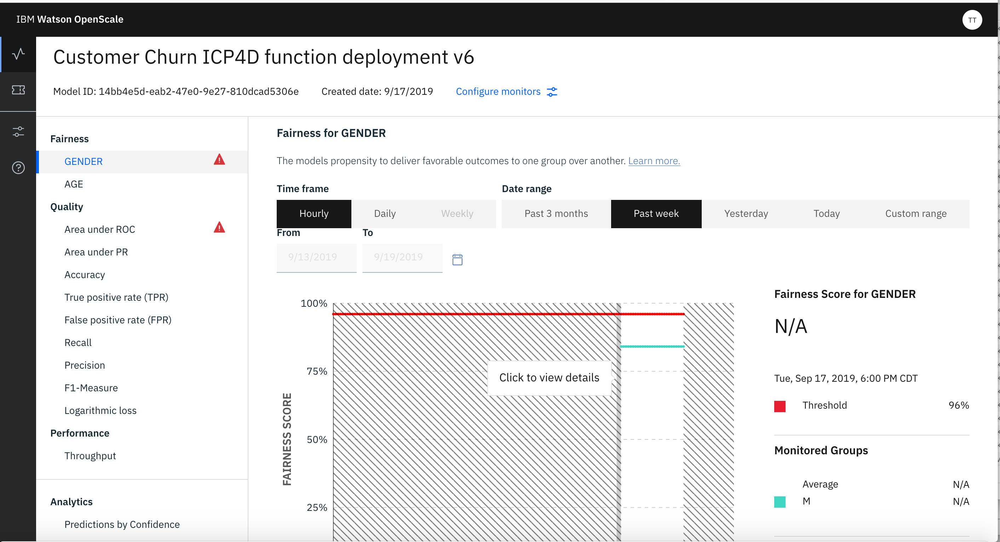
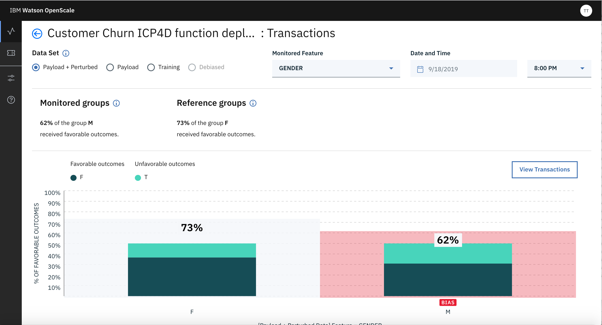
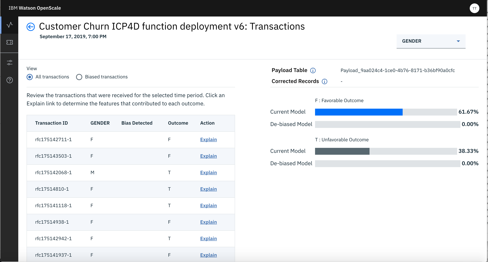
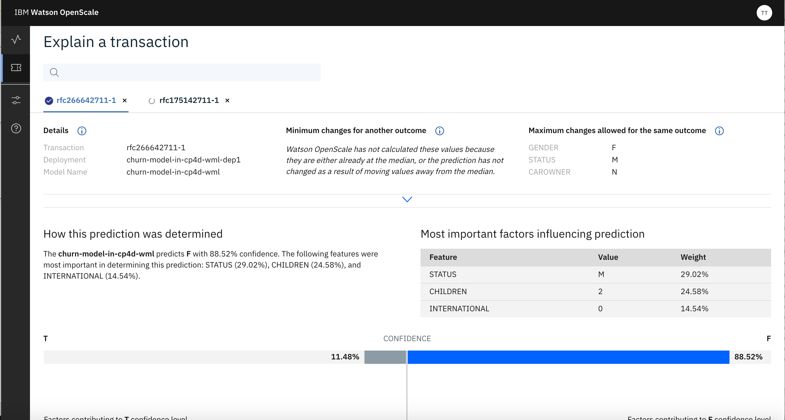
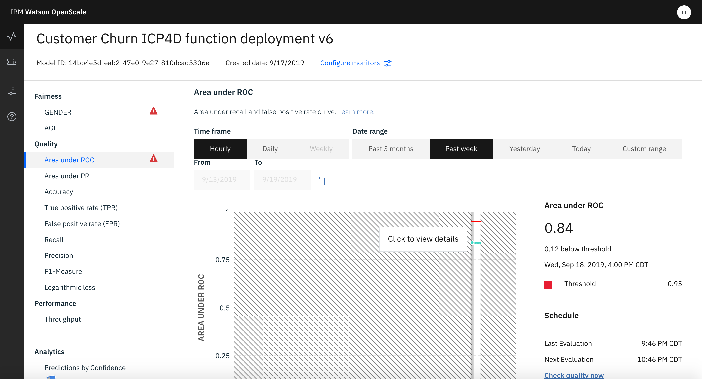
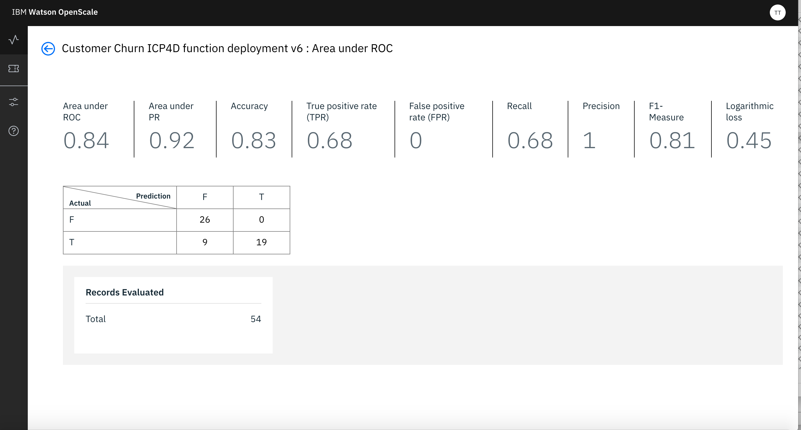

# Viewing Monitoring Results in Dashboard

Navigate to the ‘Notebooks’ tab of your project and open ‘Customer Churn Batch Scoring’ notebook using Jupyter with latest/highest version of Spark environment. You can select the environment by clicking the 3 vertical dots at the right of the name of the Notebook. 

Follow the notebook instructions and execute all cells as directed.

Please note following -

1. While Accessing the Model use Deployment ID that corresponds to the Python Function (accessing the MMD Model) that you deployed in WML in one of the previous steps.

2. Wherever, user credentials are needed please use your user if and password

3. Wherever, urls are needed use the Cloud Pak for Data URL (ip/host name and port) provided to you.

Run the above Notebook to send enough scoring requests to WML.

Now go to the Dashboard and select the tile of the Model you have already configured. 

Click the same and it will take you to the detailed view of the monitored result.

Click on, one of the Attribute you are monitoring for Fairness. It will take you to the Fairness Screen. There you can click on a particul;ar point on the line. 

That will take you to the deatils of the Fairness.

From this screen you can select View Transactions button. That will take you to the Transaction Details screen. 

There you can click on Explain link for any transaction. That would generate Explaination for that transaction. It may take few minutes for WoS to generate the Explanation

Now go back to the Dashboard and clickn on Tile of your deployment again. Click on Quality/Area Uner RoC. It will show you the Quality with respect to Threshold you have set in configuration step before.

If you click on the line of Quality (green line) you can see the details of the Quality.

