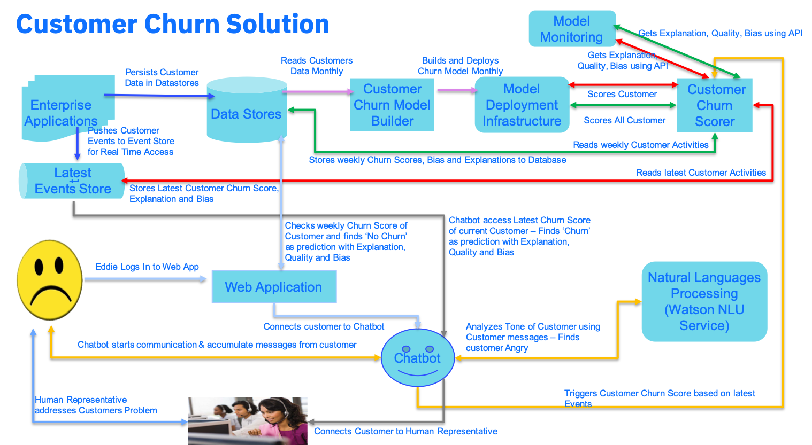

* Step 0 - Enterprise Applications persist data in Data Stores. They all pushes data to Event Stores for real time processing.
* Step 1 - Modele Builder build a Customer Churn Model based on Monthly/Haif Yearly data across all Customers. Also deploys the same in a Deployment Infrastructure
* Step 2 - The Churn Scorer, on weekly basis gets data of all Customers from the Data Store, scores the Customers for their potential to Churn. Also gets the Explanation of the Prediction, Bias of the Model and Qoverall uality/Accuracy of the model from the MOdel Monitoring system. Stores all these information in Data Store.
* Step 3 - When Eddie logins into the Web Application (after his bad experience with the Data Plan in Europe this week and latest finding that he has not got the 2nd phone), the Web Application checks the Data Store for Eddie's Churn potential (along with Explanation, Bias and model's accuracy) based on last week's result. It finds that in overall Eddie is a happy customer. So it decides to hand over Eddie to a Chatbot
* Step 4 - Chatbot starts communicating with Eddie. As the messages got exchanged the Chatbot sends those messages to Watson Natural Language Understanding for analyzing Tone of teh messages. It find the Tone to be continuously comming as Angry/Not Happy. Because of that the Chatbot triggers On Demand Churn scoring for Eddie by calling Churn Scorer.
* Step 5 - The Churn Scorer gets the latest Real Time events of Eddie from Event Store. Those events reflects Eddie's current activities (including Dropped Call, Long Distance Call etc.). It uses those latest data (along with past data accrued) to score Eddie and it finds that potential of Eddie to Churn is True. It also gets Explanation, current Bias of the Model and Qoverall uality/Accuracy of the model. It stores these information back to Event Store.
* Step 6 - The Chatbot keeps on polling Event Store for the results from On Demand Scoring for Eddie. It gets it within couple of seconds and identifies that Eddie now has a high potential for Churn. That result is also supported by Explanation, lack of Bias in the Model and overall Quality of the Model. So Chatbot hands over the call to a human representative.
* Step 7 - Human representative has now all back ground of Eddie's call, his current potential to Churn and reason. He/She, addreses Eddie's problem quickly, offers him some reqrd/incentive and stops him from cancelling the contract. The potential churn is stopped and Eddie is now happy customer again !!!
